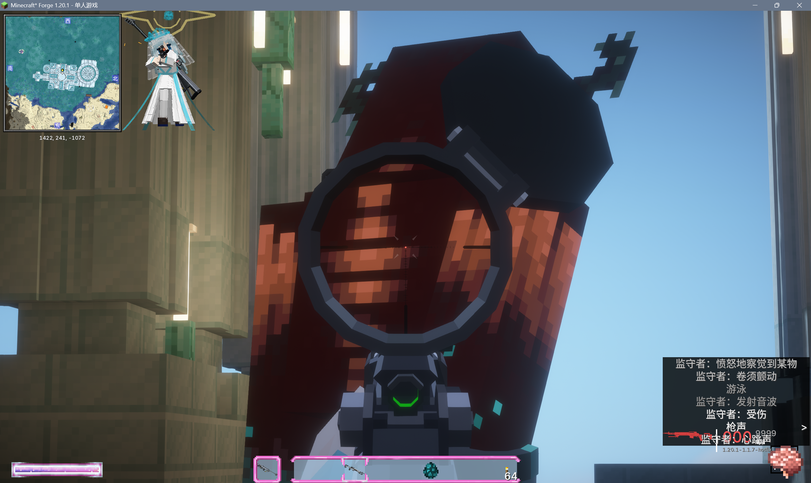

# 终焉秩序维系者 (Ultimate Order Manager) 终秩娘YSM模型

本模型是以模组"梦幻终焉 FantasyEnding"中的boss"终焉秩序维系者 (Ultimate Order Manager)"为原型开发的YSM模型，可用于正常游玩。

This model is a YSM model developed based on the boss "Ultimate Order Manager" in the "FantasyEnding" mod, and can be used for normal gameplay.

**致谢 (Credits)** 

本模型基于 梦幻终焉 FantasyEnding 开发。

This model is based on FantasyEnding.

- **原作者 Original Author**[MegaDarkness
- **源代码/原始模型来源**Source Code/Original Model Source：https://www.mcmod.cn/class/16674.html
- **原始授权 Original License**：MIT License

**授权协议 (License Agreement)** 

本项目采用 **MIT License** 开源。

This project is open source under the **MIT License**.

根据 MIT 协议的要求，本项目在分发时包含了原作者的版权声明。详细信息请参阅仓库中的 `LICENSE` 文件。

As required by the MIT License, this project includes the original author's copyright notice when distributed. Please see the `LICENSE` file in the repository for details.

**使用教程 (Usage Guide)**

**前置模组需求 Required Mods** 

此模型以 **是，史蒂夫模型 Yes Steve Model** 为前置模组。

This model requires the **Yes Steve Model** mod as a prerequisite.

点击并选择下载库中的UOM_Chan.zip文件，随后在.minecraft文件中找到正在游玩的存档中的**yes_steve_model**文件夹，在custom文件夹内粘贴已下载的.zip文件，即可在游戏内正常使用。

Click and select the UOM_Chan.zip file in your download library. Then, locate the **yes_steve_model** folder in your current save file within your .minecraft folder. Paste the downloaded .zip file into the custom folder. It will then be usable in-game.

**模型演示 Model demonstrations**

